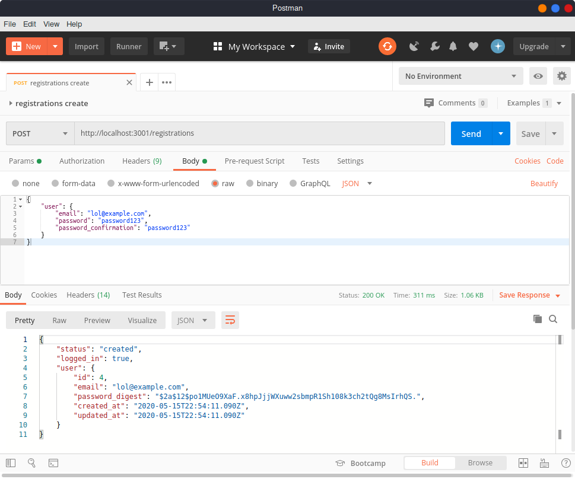
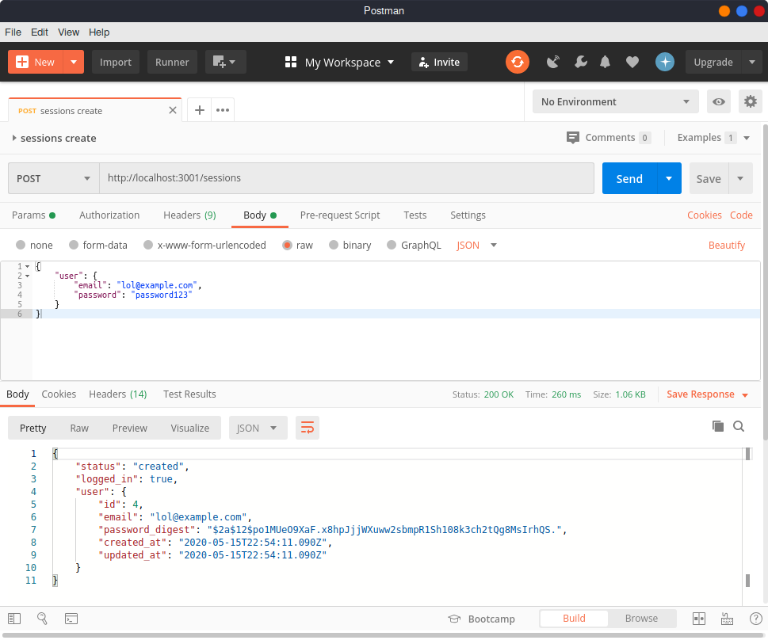

# Rails API Authentication Practice

This is a project to practice Rails API with authentication. It interfaces with this [React front end app](https://github.com/hturnbull93/auth-app-react).

## Set Up Instructions

1. Clone this repo.
2. Clone the [React front end repo](https://github.com/hturnbull93/auth-app-react).
3. In the Rails root directory run the following commands to set up the database and run the server:

    ```bash
    rails db:setup
    rails s -p 3001
    ```

4. In the React root directory run the following commands to install the dependencies run the server:

    ```bash
    npm install
    npm start
    ```

5. Navigate to <http://localhost:3000>, make new users, or log into existing users.

## Development Journal

This is a learning project, based on [this tutorial](https://www.youtube.com/playlist?list=PLgYiyoyNPrv_yNp5Pzsx0A3gQ8-tfg66j), so a lot of the code is spiked, but I plan to return and TDD the project.

### Generate Rails Repo

Generate a Rails app with PostGreSQL db, no test (will add RSpec later), and create the db once initialised.

```bash
rails new rails-auth-practice --database=postgresql -T
rails db:create
```

API only is not used as this app will leverage the regular session function offered by Rails.

### Add Gems

BCrypt for ActiveModel `has_secure_password`.

Rack-Cors to allow CORS requests from specified domains

### Configure CORS

In `config/initializers/cors.rb`:

Allow an origin domain, specify all resources with any headers and array of methods, and credentials as true.

Credentials is very important as this allows cookies to be served to the browser.

Do this for localhost:3000 (where React app will run on in development).

Also can allow the production domain (I will add this later if this gets deployed).

### Configure Session Store

In `config/initializers/session_store.rb`:

Configure a session store for a cookie store, key of '_authentication_app' (name of the cookie), and the domain (placeholder for now).

Used an if else statement to set this based on the environment (production or otherwise).

### Routes

In `config/routes.rb`:

Set root to static home.

Added `app/controllers/static_controller.rb`, defined home route rendering hello world json.

It works.

### User Model

Generate model:

```bash
rails g model User email password_digest
rails db:migrate
```

In `app/models/user.rb`:

Added `has_secure_password` method. This allows ActiveRecord password hashing and authentication methods with BCrypt.

Validates email, must be present and unique.

When creating a user a password and also a password_confirmation can be supplied, if both are the same then the user can be created (as long as the email is unique).

### Sessions Create Route

In `config/routes.rb` added sessions with create as a resources.

In `app/controllers/sessions_controller.rb` create route:

Find user by email and using '&.' (safe navigation) attempt to `authenticate` with password.

`params` are nested within user.

If the user is authenticated set `session` with the users id, then render json with status 'created', logged_in: true, and the user object.

If user find or authentication fails then json with status 401 (unauthorised) is rendered.

### Registrations Create Route

In `config/routes.rb` added registrations with create as a resources.

In `app/controllers/registrations_controller.rb` create route:

User created with email, password and password_confirmation.

If the user is able to be created set `session` with the users id, then render json with status 'created', logged_in: true, and the user object.

If the user is unable to be created (duplicate email etc) render json with status 500 (unprocessable entity).

It is important that the `create!` method is used or `user.save` is attempted so there is an error, otherwise `user` will not be committed to the database and it will be returned as 'created' but with no id.

### Disable authenticity token verification

In `app/controllers/application_controller.rb` added `skip_before_action :verify_authenticity_token`.

By default rails will attempt to verify any form submissions with an authenticity token (hidden field in form) generated by the secret key to make sure it is being sent by the actual rails app.

In this case we will be using it like an API so this verification needs to be disabled before routes.

### Demonstration with Postman

The parameters are sent in the body of the post request as json.

For registrations create:

```json
{
  "user": {
    "email": "lol@example.com",
    "password": "password123",
    "password_confirmation": "password123"
  }
}
```



For sessions create:

```json
{
  "user": {
    "email": "lol@example.com",
    "password": "password123"
  }
}
```



### Check logged in status

In `config/routes.rb`:

Added get /logged_in mapped to sessions logged_in action.

In `app/controllers/concerns/current_user_concern.rb`:

This concern includes before actions the `set_current_user` method, if there is a user in session `@current_user` is set with the user found by the session user id.

In `app/controllers/sessions_controller.rb`:

Included the CurrentUserConcern.

Added logged_in route using `@current_user` from the concern. If there is a current user render json with logged in true and the current user, else render json with logged in false.

### Logging out

In `config/routes.rb`:

Added delete /logout mapped to sessions log_out action.

Added logout route, which resets the session with `reset_session` (better than `session.clear`), and renders json with status 200 (it worked), and logged_in false.
